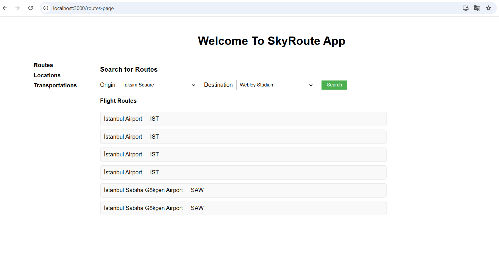
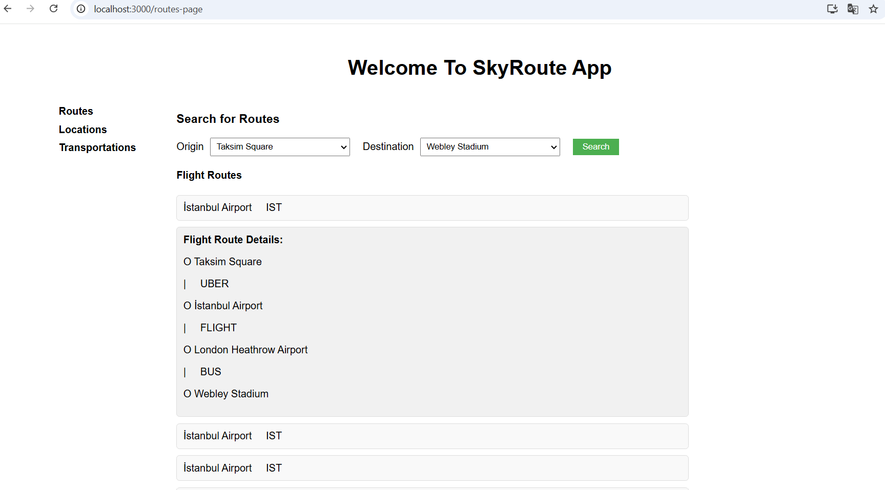
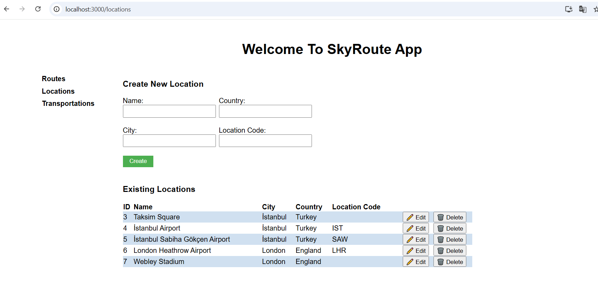
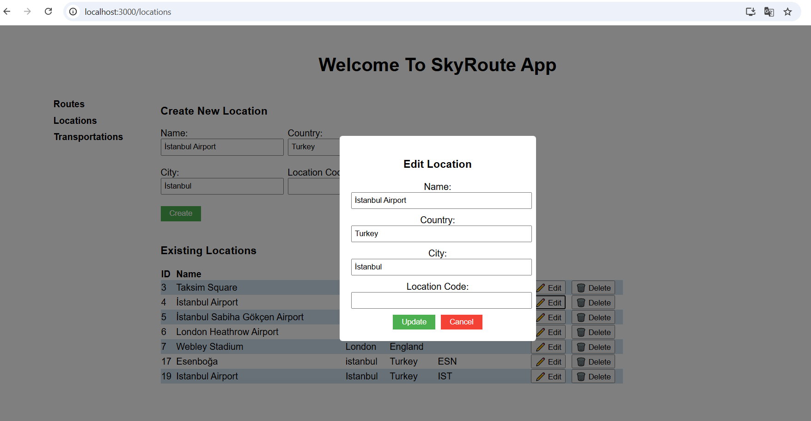
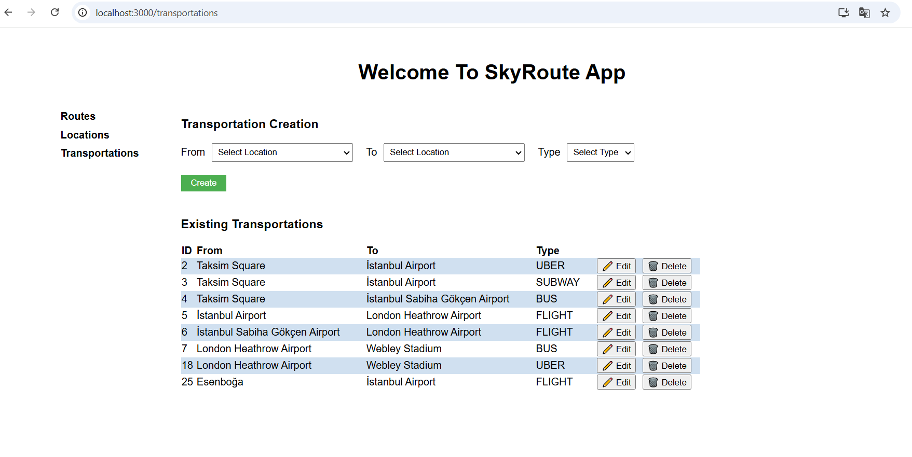
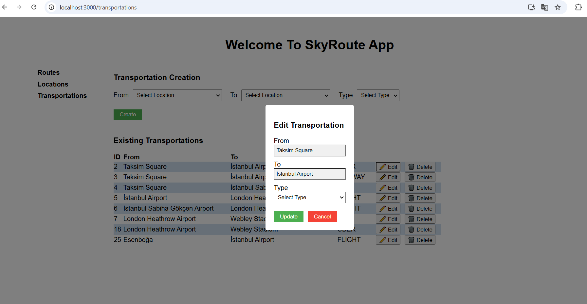

# Installation
- npm install
- npm install axios
- npm start

#  BE
- This project use an API implemented by spring boot.
- spring boot api repository: https://github.com/yusufarslanalp/SkyRoute

# Screen Shoots

